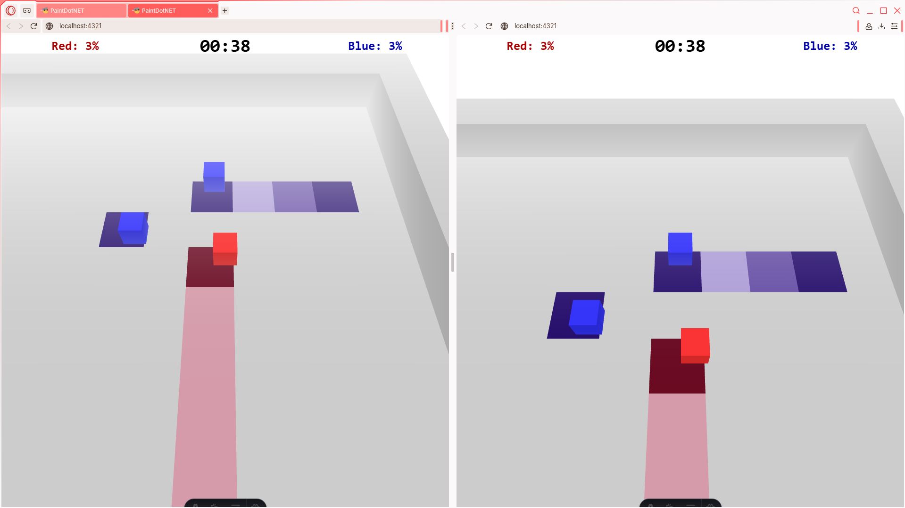

# PaintDotNET

PaintDotNET is a small game/web server application developed to showcase my C# abilities, as well as to learn relevant technologies like ASP.NET and SignalR. In the game, players can join and exit a lobby where they'll be tasked to paint over as many tiles as they can within the allotted game time. The team ending with the most coverage on the board wins!

